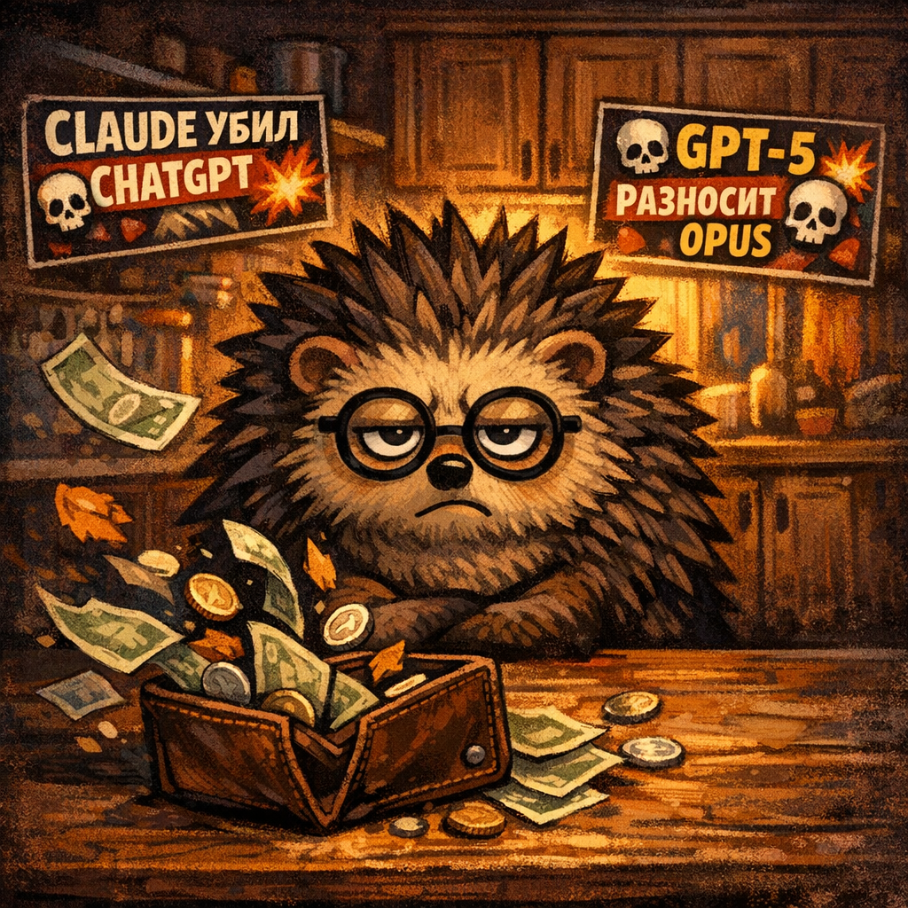
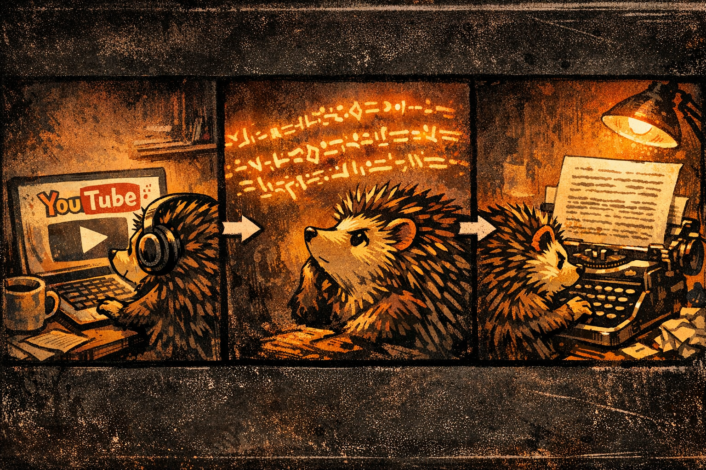
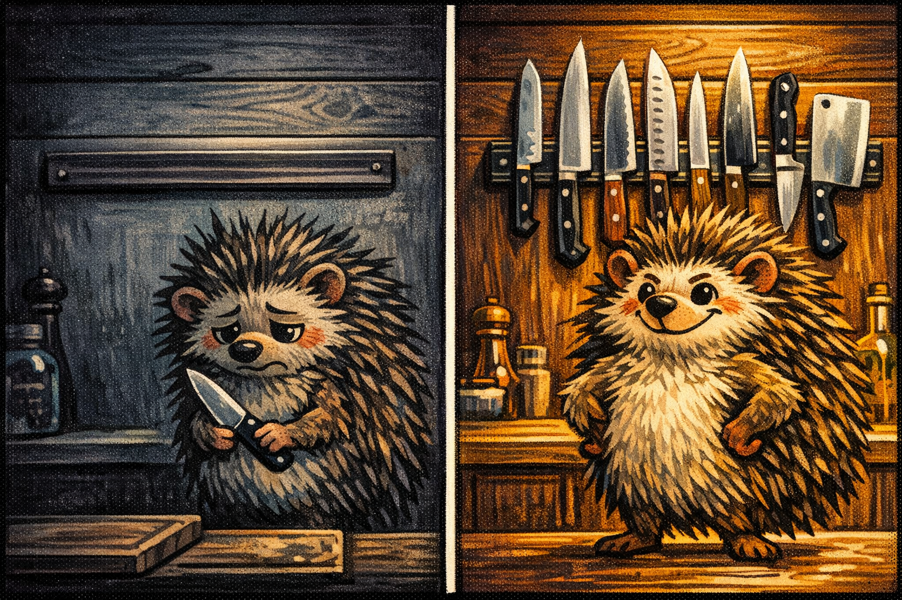
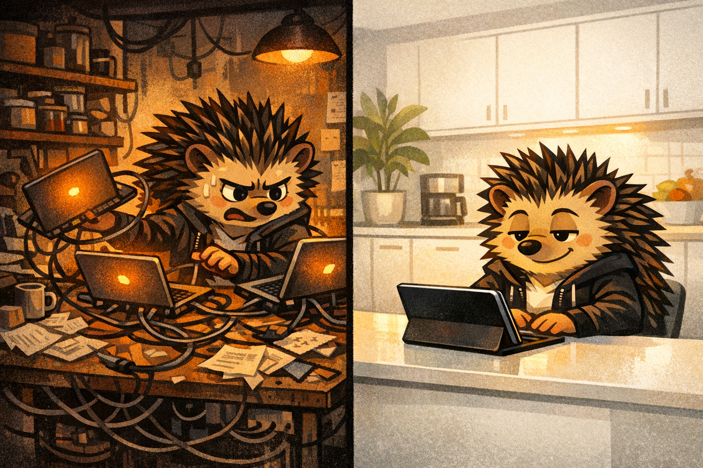

---
tags:
  - новичкам
  - выбор
  - mcp
  - claude
  - codex
  - gemini
---

# Платишь за один ИИ — теряешь половину. Claude, ChatGPT, Gemini за $40 в связке


??? abstract "Лень читать всё? Главное за 30 секунд 👇"
    **Главный вывод, чтобы закрыть и не терять время:**

    — «Claude **или** ChatGPT?» — неправильный вопрос. Правильный: **как собрать связку из 2-3 ИИ**.
    — Плати не за одного «лучшего», а за **команду**. Ценник не выше ($40 на минимуме, $240 на максимуме) — и экономит отдельную подписку Midjourney (~$30/мес).
    — **Claude Code** = дирижёр (держит проект в голове, 1M токенов).
    — **Codex** в подписке ChatGPT Plus ($20) = картинки (gpt-image-1.5) + второе мнение от GPT-5. Без страха «сжечь токены».
    — **Gemini** = видео, аудио, YouTube, Google-экосистема. Google даёт бесплатный API на сотни запросов в день — на большинство задач хватает без оплаты.
    — Склеивает их **MCP** — три команды в терминале, 15 минут настройки.

    **А если не лень — читай дальше.** Там:
    - Почему именно связка, а не «самый крутой» — и как на этом зарабатывают медиа
    - **4 случая, когда связка НЕ твоя задача** (есть шанс что ты как раз там)
    - 6 реальных сценариев из ежедневной работы (включая Wildberries/Ozon), где связка экономит часы
    - Подводные камни установки (три грабли, на которые наступает 95%)
    - Куда это катится через год — и почему собирать стоит именно сейчас

!!! abstract "Эта статья — для кого"
    Для тех, кто **уже пользуется хотя бы одним ИИ регулярно** и готов разобраться в паре команд в терминале. Если ты только что открыл ChatGPT в браузере — сначала [«Ты не кодишь — начни здесь»](no-code-start.md), там шаблоны промптов без установки. Вернёшься — эта статья подождёт.

## «Claude или ChatGPT?» — вопрос, на который нельзя ответить правильно

На Reddit (r/ClaudeAI, r/OpenAI, r/LocalLLaMA) каждую неделю — один и тот же тред. «Which subscription do I need?», «Is Claude Max worth it if I already pay for ChatGPT?», «Help me choose». Десятки комментариев, ноль консенсуса. Народ платит по $200+ и всё равно недоволен.

Десятки YouTube-превью вроде «CLAUDE УБИЛ CHATGPT 💀» и «GPT-5 РАЗНОСИТ OPUS 4.7» собирают миллионы просмотров. После просмотра ты всё равно не знаешь что оплатить — а деньги из кошелька уходят.

Потому что сам вопрос — **капкан. Его придумали не для тебя.**



---

## Ты в тупике не потому что тупой. Потому что кого-то это устраивает

Дело не в читателе. Дело в механике рынка.

**Медиа зарабатывают не на правде — они зарабатывают на тебе злом.** «А vs B» кликают лучше, чем «А + B». Это не мнение — это рекламная модель. 90% блогеров про ИИ за 2024-2026 выросли на одном приёме: берёшь релиз, находишь соперника, придумываешь победителя, выпускаешь видео. Через месяц релиз устарел — новый релиз, новый победитель, те же лица. Ты смотришь, они зарабатывают показами. Ты всё ещё не знаешь что оплатить.

**ИИ-компании не для тебя соревнуются — они соревнуются друг с другом.** OpenAI в апреле воткнул генерацию картинок в Codex не потому что пользователи просили. Потому что люди уходили к Midjourney — и надо было заткнуть дыру. Anthropic в тот же день выкатил Opus 4.7 с миллионным контекстом — не потому что кто-то рыдал от нехватки токенов, а потому что OpenAI только что сделал ход. Google тоже не спит. Они гонятся друг за другом, **а ты живёшь с итогом этой гонки** — три интерфейса, три подписки, три форума с взаимоисключающими советами.

**Те, кто реально работает с ИИ каждый день, давно перестали выбирать.** Они собирают связку из 2-3 инструментов и не вспоминают про «кто лучше». Это не заговор гиков — просто такой формат не снимают на YouTube. Кликбейт «КАК Я СОЕДИНИЛ ТРИ ИИ ЧЕРЕЗ ТЕРМИНАЛ И ПЕРЕСТАЛ СТРАДАТЬ» кликают хуже, чем «CLAUDE УБИЛ CHATGPT 💀». Поэтому YouTube-алгоритм это хоронит, а ты об этом не знаешь. Те, кто разобрался — обратно не возвращаются.

---

## Один нож для всего — идея плохая. Даже на кухне

Вопрос не «кто лучше». Вопрос — **«как собрать команду»**.

На нормальной кухне не бывает одного ножа на всё — для хлеба свой, для мяса свой, для лука свой. С ИИ то же самое. Claude, ChatGPT, Gemini — **разные инструменты с разной силой**. Попытка выбрать «самый крутой» бессмысленна, как попытка выбрать «самый крутой» нож.

Три ИИ на трёх ролях, склеенных одним протоколом. Настройка — 15 минут для того, кто уже открывал терминал. Полчаса-час для новичка (с гуглом и оленем в голове). Дальше работает каждый день.


Ниже — кто за что отвечает и как это всё работает на реальных задачах.

---

## Claude думает. Codex рисует. Gemini смотрит видео

Разберём по ролям — дирижёр, первая скрипка, оркестрант с видеокамерой. А под ними — переходник, который склеивает.

### Claude Code — дирижёр

Лидер по кодингу на апрель 2026 — Opus 4.7 держит верхнюю строчку [SWE-bench Verified](https://www.swebench.com/) (~87%), это отраслевой тест на реальные задачи программиста; GPT-5 и Gemini — следом. И самое большое контекстное окно: **1 миллион токенов** на тарифах Max — это примерно **целая книга в голове за раз**, а не один файл.

*Терминология:* сам ты всё равно главный дирижёр. Claude Code — просто главный по оркестру из ИИ, за ноты отвечает. Ты задаёшь партитуру.

Сильные стороны:
- Сложные рефакторинги в больших кодовых базах
- Архитектурные решения и планирование
- Работа с git, терминалом, файловой системой
- Длинные сессии — помнит контекст часами

Роль в оркестре: **дирижёр**. Он знает план, смотрит на проект сверху, решает кого куда отправить.

### Codex — первая скрипка (картинки + GPT-5)

С 16 апреля 2026 Codex desktop app (агент от OpenAI, вход через аккаунт ChatGPT Plus за $20/мес) умеет генерировать картинки из коробки — через модель gpt-image-1.5. Раньше за иконки, обложки, рекламные баннеры платили отдельно — Midjourney, nano-banana API, токенами. **Теперь та же ChatGPT-подписка покрывает и это** — в рамках квоты Plus.

Плюс в Codex живёт GPT-5 как источник «второго мнения» по коду. Когда Claude выдал решение, а хочется проверить другим мозгом — отправляем в Codex.

Роль в оркестре: **первая скрипка**. Специалист по визуалу и независимой экспертизе.

### Gemini — оркестрант с видеокамерой

Уникальная штука: Gemini **буквально смотрит видео и слушает звук**. Не читает транскрипт, а смотрит ролик и переваривает его напрямую. YouTube, лекции, скринкасты, подкасты — всё это ему можно скормить как есть.

Плюс всё что касается Google-экосистемы: Maps, Translate, Search, YouTube Data API.

Google даёт бесплатный API через Google AI Studio — лимиты зависят от модели: у Flash-lite щедро (сотни запросов в день), у Pro строже (десятки). Для быстрых задач — транскрипт, перевод, краткий анализ видео — бесплатного хватает. Нужно больше — подписка Gemini Advanced или платный API.

Роль в оркестре: **видео и Google-экосистема**. Глаза и уши оркестра.



---

### MCP — удлинитель, в который всё это втыкается


MCP — **удлинитель**. Три вилки в одну розетку. Ты пишешь задачу Claude — он сам дёргает Codex за картинкой и Gemini за видео. Не три чата, не три вкладки — **один разговор**.

Технически это открытый протокол от Anthropic, который OpenAI и Google подхватили в 2026-м — впервые три главных ИИ говорят на одном языке. Дальше — три команды в терминале, и связка собрана.

Детали MCP не обязательны для работы связки. Если интересно — [«Интеграции (MCP)»](../apps/integrations/index.md). Если нет — пропускай.

??? info "Как поставить связку (15 минут в терминале)"
    **Перед стартом:** нужен установленный Codex CLI (`npm install -g @openai/codex` или `brew install --cask codex` — подробнее [тут](../apps/agents/codex-cli.md)) и `OPENAI_API_KEY` от OpenAI (для zen-mcp-server — см. platform.openai.com/api-keys).

    ```bash
    # Основной канал к Codex
    claude mcp add codex -- codex mcp-server

    # Мультимодельный оркестратор (Claude ↔ GPT-5 ↔ Gemini)
    claude mcp add zen --scope user \
      -e OPENAI_API_KEY=$OPENAI_API_KEY \
      -- uvx --from git+https://github.com/BeehiveInnovations/zen-mcp-server.git zen-mcp-server

    # YouTube-транскрипты через Gemini
    claude mcp add youtube -- npx -y youtube-transcript-mcp
    ```

    После установки — перезапусти Claude Code, проверь `/mcp` внутри сессии. Должны появиться `codex`, `zen`, `youtube` в списке.

    **Подробнее по каждому инструменту:**

    - **Codex CLI** + image-gen в подписке — [Картинки через ChatGPT за $20](image-gen-via-chatgpt.md) и [Codex CLI](../apps/agents/codex-cli.md)
    - **zen-mcp-server** (второе мнение от GPT-5/Gemini) — [репозиторий BeehiveInnovations](https://github.com/BeehiveInnovations/zen-mcp-server) (полный гайд ещё не написан, в планах)
    - **youtube-transcript-mcp** — [npm-пакет](https://www.npmjs.com/package/@kimtaeyoon83/mcp-server-youtube-transcript) (отдельная наша статья про Gemini+YouTube — в планах)

---

## 6 задач, которые связка закрывает уже сегодня

Это не «возможности на бумаге». Это сценарии, которые работают в проде прямо сейчас.

### 1. YouTube-видео → готовая статья

Здесь важный нюанс: **сам Claude Code видео смотреть не умеет**. Подкинешь ему ссылку на YouTube — ничего не произойдёт. А вот Gemini умеет — он реально открывает ролик, смотрит картинку и слушает звук, а не дёргает готовые субтитры (которых часто просто нет).

Поэтому связка такая: кидаешь Claude ссылку → он просит Gemini посмотреть ролик и вернуть суть → сам превращает эту суть в пост, статью или конспект в твоём стиле. **Без копипаста, без youtube-dl, без «открой ссылку и посмотри сам».**

**Пример из практики:** Лекция Andrej Karpathy [«Deep Dive into LLMs»](https://www.youtube.com/watch?v=7xTGNNLPyMI) идёт 3 часа 31 минуту. Вручную конспект — минимум рабочий день. Через связку: кидаешь ссылку Claude, Gemini смотрит ролик целиком (не субтитры, а видео — видит схемы на слайдах, слышит интонацию), возвращает структурированную выжимку по блокам. Claude переводит её на русский и переписывает в твоём стиле (для поста, статьи, конспекта). **3,5 часа видео → 15-минутный конспект на читабельном языке за ~5 минут машинного времени.**

Особенно выручает на длинных лекциях, подкастах и созвонах, где нужна суть, а не пересказ всего.

### 2. Слежка за YouTube-каналами без зависания в ленте

Claude раз в день опрашивает интересные каналы через Gemini-MCP и кидает тебе в чат: «вышел новый ролик у такого-то, тема X, суть такая-то». Сам ролик смотреть не обязательно — если суть не твоя, пропускаешь за 10 секунд. Если твоя — идёшь смотреть уже с пониманием контекста.

### 3. Картинки в подписке, без страха «сжечь деньги»

Нужна обложка для поста? Иконка для лендинга? Баннер для рекламы? Говоришь Claude — тот просит Codex сгенерить. **За ту же $20-подписку ChatGPT Plus**.

Но главное — не в экономии. Главное в **смене психологии использования**.

Раньше, с nano-banana / Midjourney / Ideogram через API, каждая картинка — это токены, то есть **живые деньги**. Поэтому агенту доступ к генерации давать было страшно: вдруг не тот промпт использует, вдруг зациклится, вдруг уйдёт в бесконечную правку — и в конце месяца придёт счёт на $200 за картинки, которые ты даже не видел. Поэтому люди либо генерили вручную (открыл Midjourney, по одной), либо ставили жёсткие лимиты-заглушки.

Сейчас всё иначе. Подписка — фиксированная абонплата, не оплата по часам. Агенту можно **доверить** генерировать сколько ему надо: хоть 50 вариантов обложки перед финалом, хоть переделать мем 10 раз — счёт от этого не растёт. Упрёшься разве что в квоту ChatGPT Plus (rate limit), тогда подождёшь пару часов. Денег не теряешь.

Это **меняет саму модель работы с картинками**: вместо «сэкономлю на генерации» → «пусть агент крутит до результата».

Пошаговая инструкция (с обходом 3 ключевых граблей) — [Картинки через ChatGPT за $20](image-gen-via-chatgpt.md). Все картинки в этой статье сгенерированы именно так.

### 4. Второе мнение по коду от GPT-5 и Gemini

Сложная архитектурная развилка? Отправляешь кусок кода на ревью через `zen-mcp` — оно параллельно дёргает GPT-5 и Gemini, возвращает два независимых мнения. Claude сводит выводы, говорит тебе консенсус и расхождения. **Твой основной контекст не засоряется**.

Это не просто другой LLM — это разные школы мышления. GPT-5 чаще видит риски, Gemini — альтернативные подходы, Claude — архитектурную картину.

### 5. Перевод длинных писем и сведение сути — на входе, не руками

Клиент прислал англоязычный контракт на 15 страниц. Партнёр из Китая кидает сообщение на китайском с деталями. Подкаст на испанском, про твою тему. В одиночку это всё — час чтения + час адаптации.

Связка: Gemini читает входящее (видео / аудио / длинный PDF), вытаскивает суть на русском. Claude превращает суть в ответ / конспект / памятку в твоём тоне. Ты проверяешь, при необходимости правишь голос, и отправляешь.

Работает и на **пачке входящих**: 30 отзывов клиентов, 50 комментариев под видео конкурента, протокол встречи на 2 часа — Gemini выжимает суть, Claude группирует по темам и выдаёт тебе разбор. Дальше решения — твои.

Важно трезво: **финальный тон всё равно за тобой**. Gemini хорошо переваривает контент, но если нужен голос бренда / деликатный клиентский ответ / тонкая локализация — это докручиваешь сам, а не отдаёшь на автомат. Для точного голосового дубляжа есть специализированные сервисы (ElevenLabs и подобные) — это уже отдельный инструмент поверх связки.

### 6. Wildberries и Ozon: карточки, отзывы, конкуренты

Если торгуешь на маркетплейсах — связка снимает три типичные рутины за час вместо дня:

- **Карточки товаров.** Кидаешь Claude фото товара + сухие характеристики. Он передаёт фото в Gemini (тот буквально видит что на картинке), а Codex параллельно генерит доп-картинки-инфографики. На выходе — готовое SEO-описание 150-200 символов + 3-5 картинок для карусели. Сразу на всю линейку, не по одной.
- **Отзывы оптом.** 50 отзывов за ночь — скидываешь пачку в Claude, Gemini читает, Claude группирует по темам («доставка», «размер», «качество»), пишет черновики ответов в твоём тоне. Ты только проверяешь и жмёшь «отправить» — или правишь острые.
- **Конкуренты.** «Посмотри топ-20 карточек по запросу X на WB — цены, фото, ключи, отзывы, что хвалят, на что жалуются». Claude через Gemini/Playwright собирает, сводит в таблицу, выдаёт **где твоя карточка слабее и что в ней поправить**. То, что раньше делал SMM-специалист за 3-5 часов, связка делает за 20 минут.

Ключевое — **ты не жжёшь деньги на API-токены** (см. кейс №3). Агент крутит по 30 карточек подряд за фиксированную подписку, не боится «ошибиться промптом и выжечь $50».



---

## Через год связка может стать необязательной. Пока — без неё отстаёшь

**OpenAI двигает тренд «всё из коробки».** Сначала картинки в Codex — остальные подтягиваются. **Anthropic** ответил [Claude Design](https://claude.ai/design/) — отдельное рабочее пространство, где Claude собирает живые HTML-прототипы сайтов под брифы. **Google** идёт ещё шире: у них уже целый парк сервисов, аналогов которых пока нет ни у кого — включая [NotebookLM](https://notebooklm.google.com) (загружаешь свои документы — получаешь собеседника, который знает только их), подключаемый в Claude Code через MCP.

**Следующий ожидаемый шаг — research и веб-поиск прямо в агенте**, без костылей. Сейчас приходится ставить отдельно Exa MCP ($20+/мес), Perplexity API ($5/1M токенов), Tavily, Playwright для «человеческого» браузера. Если компании не сломаются от релизных задержек — за 6-12 месяцев встроенный deep-search появится у всех троих.

Если этот сценарий сбудется — через год один агент за одну подписку закроет и дизайн, и ресёрч, и код, и видео. Тогда связка из трёх станет опциональной, а не обязательной.

Это прогноз, не факт. Дорожные карты часто сдвигаются — так было с web-поиском в Claude, который обещали «скоро» с 2024-го, а получили в виде MCP только в 2026. Но **пока мы точно не там**. Пока — собирай оркестр.



---

## Узнал себя в одном из 4 пунктов — связка не нужна

Эта связка — не для всех. Вот когда лучше не собирать оркестр и остаться на одном ИИ:

- **Эпизодически пользуешься ИИ** — раз в неделю спросить у ChatGPT идею для поста. Одной подписки хватает. Нет смысла настраивать три и платить как за три.
- **Работа целиком в браузере** — открывать терминал, ставить MCP, командная строка пугает. Без этого часть связки не заработает. Либо учись, либо оставайся на одном.
- **Компания с жёстким compliance** — три разных поставщика = три политики приватности = три ревью безопасности. Иногда проще взять один корпоративный тариф.
- **Ты только начинаешь работать с ИИ** — разберись с одним инструментом (обычно ChatGPT), поживи с ним месяц, наступи на грабли. Потом приходи за связкой. См. [«Ты не кодишь — начни здесь»](no-code-start.md) — шаблоны промптов без установки.

Ещё один минус — **переключение контекста**. Три сервиса = три окна, иногда путаешь «кому какая задача». Выручает только если у тебя **один главный** (Claude Code) который сам дёргает остальных через MCP. Руками прыгать между тремя чатами — утомительно.

---

## $40 на минимуме, $240 на максимуме — и всё равно работает

Конкретные цифры на апрель 2026:

| Подписка | Цена | Что даёт |
|---|---|---|
| **Claude Max** (основная) | $100 или $200 / мес | 1M токенов, Opus 4.7. Два тарифа — с повышенным (5×) или максимальным (20×) лимитом запросов |
| **ChatGPT Plus** (Codex) | $20/мес | Codex desktop app, gpt-image-1.5 (картинки в подписке), GPT-5 |
| **Gemini** (бесплатный API) | $0 | Google AI Studio — лимиты зависят от модели, Flash-lite щедро, Pro строже |

**Итого: ~$120-220 в месяц** — и у тебя три инструмента вместо одного компромиссного.

Если бюджет жмёт — минимальная рабочая связка: **Claude Pro ($20) + ChatGPT Plus ($20) + Gemini Free**. Это $40/мес и **90% функциональности**. Не хватит только для тяжёлых проектов с миллионными контекстами — там уже нужен Claude Max.

Если бюджет есть — **Claude Max + ChatGPT Plus + Gemini Advanced** (платный Gemini $20 с увеличенными лимитами и Deep Research). Это $140-240/мес и максимум из того что есть в коробке.

!!! tip "Главный принцип"
    **Не «либо», а «вместе».** Не «какая подписка лучше», а «какая связка под мои задачи». Одна подписка = компромисс во всех направлениях. Связка из трёх = лучшее от каждого.

Подробный разбор бюджетов («арбузные» варианты, DeepSeek / OpenRouter, когда API дешевле подписки) — [Бюджет на ИИ: 0 → $200](budget.md).

---

## Не разобрался — пиши

> **Застрял на установке связки? Пиши @omius в Telegram.**
>
> Не консультант на галстуке — сам прошёл эти грабли. Задашь вопрос — отвечу. Если запрос крупный (настройка связки с нуля, разбор твоего workflow) — скажу как помочь.

---

## Обновления и новости

Когда выходит новое обновление в любом из трёх — в [@agentezh](https://t.me/agentezh) разбираем без кликбейта и хайпа.

*Обновлено 20 апреля 2026. Если цифры или условия подписок поменялись — поправим, пиши в [@omius](https://t.me/omius).*
