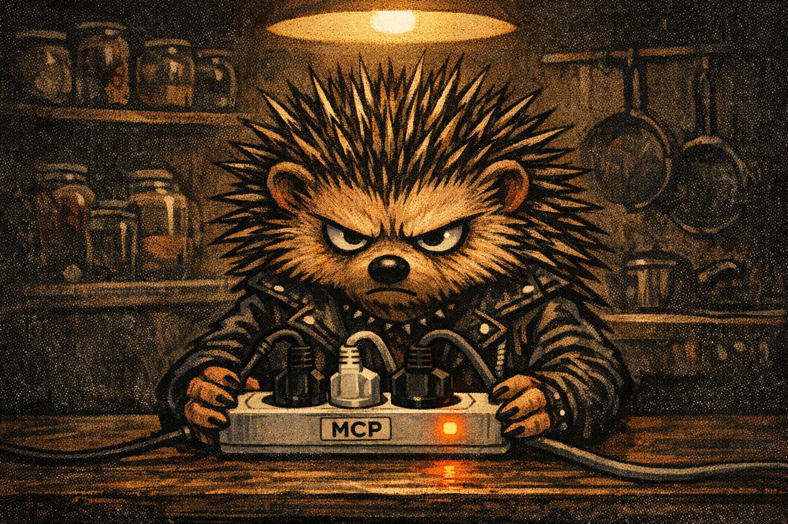

---
tags:
  - codex
  - картинки
  - chatgpt
  - экономия
---

# Как рисовать картинки из Claude Code за $20-подписку ChatGPT, а не $50 на Midjourney

Если ты пишешь код в Claude Code и регулярно нужны картинки — обложки, иконки, мемы, баннеры — ты, скорее всего, платишь либо **Midjourney $30/мес**, либо **nano-banana / Ideogram / Flux API** (токены по $0.01-0.10 за штуку), либо вручную открываешь ChatGPT в браузере и копипастишь по одной.

Всё это — пережиток. С **16 апреля 2026** OpenAI добавил встроенную генерацию картинок (`gpt-image-1.5`) прямо в **Codex CLI**, и эта функция **покрывается обычной подпиской ChatGPT Plus за $20/мес**. Не токены. Не отдельные API-счета. Подписка. И вызывается прямо из Claude Code через один инструмент.

Ниже — пошаговая инструкция как это подключить. Проверено на macOS (apple silicon), Codex CLI 0.121.0, Claude Code Desktop.



## Сначала — почему это не очевидно

Даже зная про Codex, 95% пользователей упираются в **одну и ту же ошибку**:

> *The `imagegen` skill requires the built-in `image_gen` tool... Use the imagegen CLI fallback? OPENAI_API_KEY must be set for live API calls.*

Codex говорит «нужен API-ключ», хотя ты платишь $20 за Plus. Выглядит как «разводят на ещё один биллинг».

На самом деле **Plus-подписка реально покрывает image-gen**, но в `codex exec` (non-interactive режим, из которого Claude Code вызывает Codex) эта фича **отключена feature-флагом по умолчанию**. Модель уходит в fallback-ветку и требует API-ключ. Документация OpenAI об этом молчит — узнаёшь из community-обсуждений и собственных синяков.

Решение — один флаг + одна настройка окружения. Ниже.

## Шаг 1. Установить Codex CLI и залогиниться

```bash
# Установка
npm install -g @openai/codex
# или через Homebrew:
brew install --cask codex

# Проверка
codex --version                # должно быть >= 0.121.0

# Логин через ChatGPT OAuth (откроется браузер)
codex login
codex login status             # должно вернуть "Logged in using ChatGPT"
```

Важно: логиниться **через ChatGPT**, не через API-ключ. Подписочная квота применяется только при OAuth-входе.

## Шаг 2. Убрать `OPENAI_API_KEY` из окружения

Если в `~/.zshrc` / `~/.bashrc` / launchd выставлен `OPENAI_API_KEY` — **Codex молча использует его вместо OAuth-токена**. Это [баг/фича](https://github.com/openai/codex/issues/15151), и через API image-gen платный.

```bash
# Проверить
echo $OPENAI_API_KEY           # должно быть пусто

# Если не пусто — убрать временно
unset OPENAI_API_KEY

# И убрать из shell-rc навсегда
grep "OPENAI_API_KEY" ~/.zshrc ~/.bashrc ~/.zprofile
# Если что-то нашлось — отредактируй и удали строку
```

Без этого фикса — не взлетит. Это самая частая причина «Codex просит API-ключ».

## Шаг 3. Обойти баг с кириллицей в пути

Codex передаёт текущую рабочую директорию в HTTP-заголовок `x-codex-turn-metadata`. Если в пути есть non-ASCII (кириллица, иероглифы) — заголовок не проходит UTF-8 encoding и websocket падает на `Reconnecting...`.

Фикс — работать из ASCII-only папки:

```bash
mkdir -p /tmp/codex-clean
cd /tmp/codex-clean
# отсюда запускать codex exec
```

Результат потом копируется в нужное место через `Save as /abs/path/to/result.png` в промпте.

## Шаг 4. Правильная команда генерации

```bash
cd /tmp/codex-clean
codex exec \
  --enable image_generation \
  --full-auto \
  --skip-git-repo-check \
  '$imagegen Описание картинки здесь. NO readable text on image. Save as /абс/путь/output.png. Size 1024x1024.'
```

Ключевые элементы:

- **`--enable image_generation`** — активирует feature-flag для built-in image tool. БЕЗ НЕГО БАГ С API-КЛЮЧОМ
- **`$imagegen`** в начале промпта — триггер image-gen skill'а
- **`--full-auto`** — Codex не спрашивает подтверждений на каждую команду
- **`--skip-git-repo-check`** — не требует git-репо в cwd
- **`Save as /abs/path.png`** — абсолютный путь сохранения (Codex внутренне сохраняет в `~/.codex/generated_images/<uuid>/` и копирует к тебе)
- **`Size WxH`** — `1024x1024` (квадрат) или `1536x1024` (landscape)

Генерация занимает **1-3 минуты** на картинку. Выглядит медленно по сравнению с Midjourney — но это подписочная генерация, не токеновая. Бесплатно.

## Шаг 5. Как вызывать из Claude Code

После установки — Claude Code умеет делать это через встроенный **Bash-инструмент**, без отдельного MCP-сервера. Просто скажи:

> «Сгенери обложку для моего поста про X — ёж с ноутбуком, тёмный editorial-punk стиль»

Claude Code сам составит промпт, запустит `codex exec --enable image_generation` из `/tmp/codex-clean/`, дождётся результата и покажет.

Если хочешь сделать это **автоматическим паттерном для всех проектов** — поставь [наш глобальный skill](https://github.com/omiusgm/claude-code-image-skill) (ссылка на репо появится после публикации), он работает как готовый пресет.

## Ограничения подписочной генерации

Честно — не все задачи закрывает:

- **Русский текст внутри картинки** модель не умеет — выдаёт псевдо-кириллицу. Решение: делать подписи markdown'ом снаружи.
- **Фотореалистичные лица реальных людей** — фильтрация или «пластиковое подобие».
- **Точное количество мелких объектов** (10+) — модель проигнорирует, нарисует «много».
- **Квота Plus** — не бесконечная. Тяжёлые batch'и (десятки картинок за час) упрутся в rate-limit; подождать 1-6 часов.

Для типовых задач вайбкодера / предпринимателя / SMM-щика (обложка поста, иконка карточки, баннер для лендинга, мем в канал) — **полностью хватает**.

## Сколько это экономит

Типовой стек до Codex image-gen:

| Инструмент | Цена/мес | Кейс |
|---|---|---|
| Midjourney Standard | $30 | Обложки, баннеры |
| ChatGPT Plus | $20 | Чат |
| **Итого** | **$50/мес** | |

После:

| Инструмент | Цена/мес | Кейс |
|---|---|---|
| ChatGPT Plus | $20 | И чат, **и картинки** |
| **Итого** | **$20/мес** | |

Экономия **$30/мес** = $360/год на одном рабочем сетапе. Плюс — не надо держать отдельный workflow: всё в одном агенте (Claude Code), одна подписка.

!!! tip "Главный принцип"
    Если у тебя уже есть ChatGPT Plus — **Midjourney и nano-banana подписки больше не нужны** для 95% задач. Продли Plus, отмени остальное.

## Если не взлетает — чеклист для диагностики

Частые ошибки и их симптомы:

| Симптом | Причина | Фикс |
|---|---|---|
| «OPENAI_API_KEY must be set...» | `$OPENAI_API_KEY` выставлен в env | `unset OPENAI_API_KEY` |
| «imagegen skill requires built-in...» | Забыл `--enable image_generation` | Добавить флаг |
| «Reconnecting... failed to convert header» | Кириллица в cwd / git-предке | `cd /tmp/codex-clean && codex exec ...` |
| «Logged in using API key» | Залогинился через API, не через ChatGPT | `rm ~/.codex/auth.json && codex login` (выбрать ChatGPT) |
| Ничего не происходит 5 минут | Фоновая генерация идёт, ждёт | `tail -f codex.log` — смотреть прогресс |

Если ни одно из выше не подошло — пиши [@omius](https://t.me/omius) с логами, разберём.

## Дальше — связки и оркестры

Это был **один инструмент связки**: Codex как генератор картинок. Полная архитектура с тремя ИИ (Claude как дирижёр, Codex как картинки+second opinion, Gemini как видео-аудио) — в [Какой ИИ выбрать: собери свой оркестр](choose-agent.md).

Бюджетные варианты целиком, от $0 до $240 — в [Бюджет на ИИ](budget.md).

---

*Обновлено 20 апреля 2026. Проверено на Codex CLI 0.121.0, macOS 25.4, Claude Code Desktop.*
